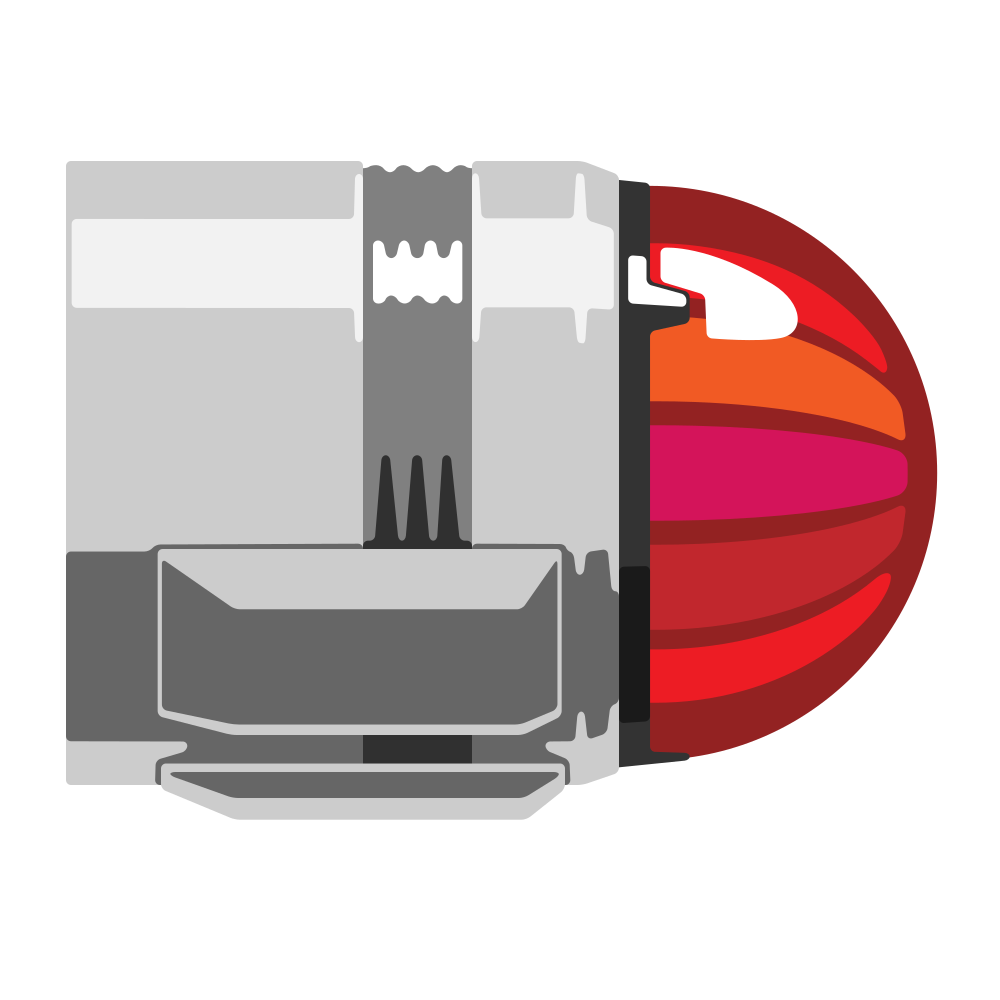

# Codename "Bussard"
<p align="center">
    
</p>

A [free and open source](https://en.wikipedia.org/wiki/Free_and_open-source_software) physical collection management software.

"Bussard" is a temporary code-name, named after the "[Bussard Collectors](https://memory-alpha.fandom.com/wiki/Bussard_collector)" at the front of Star Trek federation ship warp nacelles. 

Logo created by [Noel Rupenthal](https://ca.linkedin.com/in/noel-ruppenthal-4217628).

## Development

These are all *recommended* settings, you don't *need* to follow those, but that's what I used.

### Prerequisites

1. Linux (or WSL) with:
    1. Node 22.0 or above with NPM (install with [NVM](https://github.com/nvm-sh/nvm?tab=readme-ov-file#installing-and-updating))
    1. Docker (see [this guide](https://daniel.es/blog/how-to-install-docker-in-wsl-without-docker-desktop/) for installation in WSL)
1. VSCode with a ProstegeSQL extension

### ProstegeSQL

To configure ProstegeSQL, follow these steps:

1. Create a `.env` file in the root directory with the following content:

    ```env
    POSTGRES_USER=bussard_user
    POSTGRES_PASSWORD=changeme
    POSTGRES_DB=bussard_db
    ```

    > [!IMPORTANT]
    > Replace `changeme` with a strong password!  
    For local development, avoid special characters (like `@`) to prevent connection string encoding issues.

1. Run the database with:

    ```bash
    docker-compose up -d
    ```

1. Connect to the database with the following settings:

    - Host: `localhost`
    - Port: `5432`
    - User: `bussard_user`
    - Password: The password from step 1
    - Database: `bussard_db`
    - SSL: `disable`
